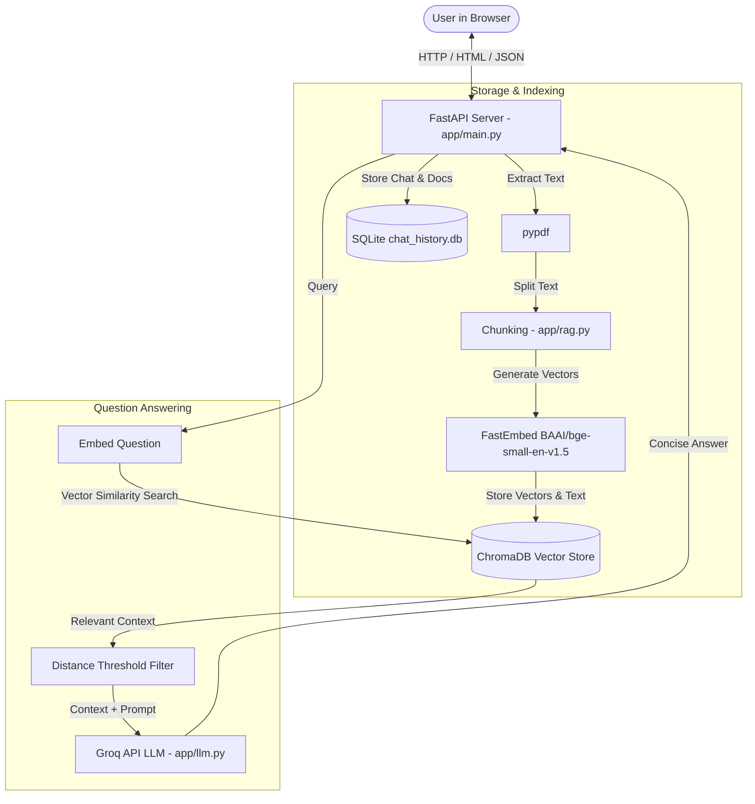
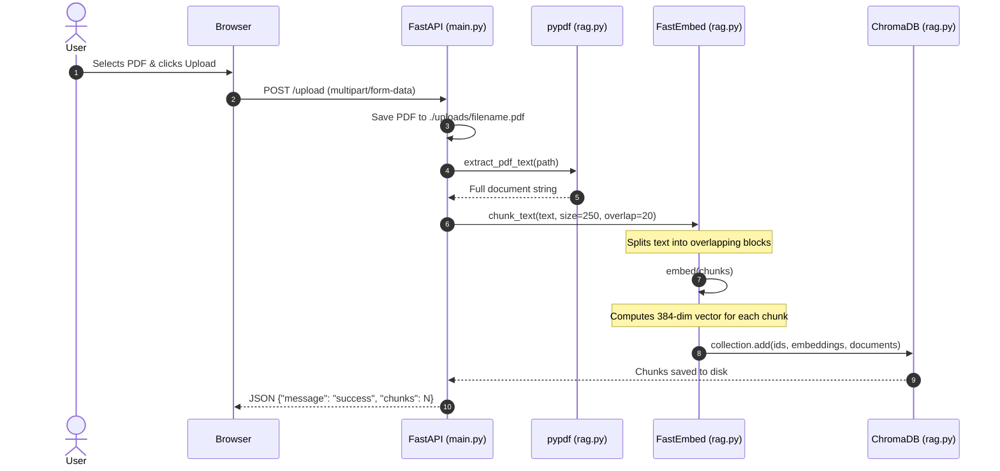
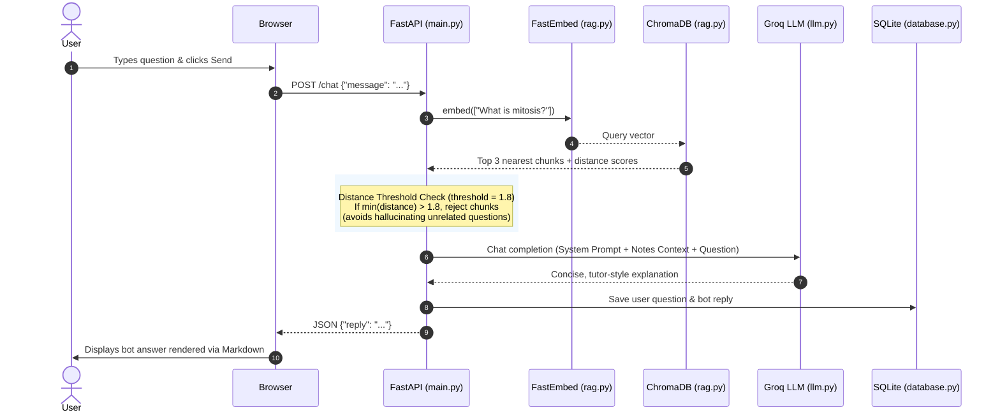

# 📘 StudyMate — Project Overview & Developer Guide

Welcome to **StudyMate**! This guide is written for developers and learners of all skill levels. It explains what StudyMate is, how every part of the application works under the hood, why specific libraries and databases were chosen, and how the entire **Retrieval-Augmented Generation (RAG)** pipeline operates step-by-step.

---

## 📑 Table of Contents
1. [Project Description](#-project-description)
2. [High-Level Architecture](#-high-level-architecture)
3. [Folder Structure & Component Breakdown](#-folder-structure--component-breakdown)
4. [Important Libraries & Their Exact Use Cases](#-important-libraries--their-exact-use-cases)
5. [The Two Databases: SQLite vs. ChromaDB](#-the-two-databases-sqlite-vs-chromadb)
6. [How It Works Under the Hood (The RAG Pipeline)](#-how-it-works-under-the-hood-the-rag-pipeline)
7. [Step-by-Step Execution Lifecycle](#-step-by-step-execution-lifecycle)
8. [Developer Cheatsheet & Common Commands](#-developer-cheatsheet--common-commands)

---

## 🎯 Project Description

### What is StudyMate?
**StudyMate** is an AI-powered study companion. It allows students to upload PDF textbooks, lecture notes, or research papers and chat with them in real time. 

### What Problem Does It Solve?
Standard AI models (like ChatGPT) have two big problems when studying:
1. **Knowledge Cutoff & Lack of Personal Notes:** They do not know what is written in your specific lecture slides or professor's notes.
2. **Hallucination:** When an AI does not know the answer, it often invents plausible-sounding but false information.

StudyMate solves this using **Retrieval-Augmented Generation (RAG)**:
- It extracts and indexes the text from your uploaded PDF.
- When you ask a question, it searches the document for only the relevant paragraphs.
- It passes **only those paragraphs** to the AI model as context, instructing it to answer strictly based on your notes. If the answer isn't in your notes, it informs you directly.

---

## 🏗 High-Level Architecture

Here is how the data flows between the user, the server, the databases, and the AI:



---

## 📁 Folder Structure & Component Breakdown

```
StudyMate/
├── app/
│   ├── __init__.py         # Marks 'app' as a Python package
│   ├── main.py             # FastAPI entrypoint, HTTP route handlers, server initialization
│   ├── rag.py              # PDF extraction, chunking, embedding generation & ChromaDB search
│   ├── llm.py              # Groq API client configuration and prompt engineering
│   └── database.py         # SQLite database helper for chat history and document logs
├── templates/
│   └── index.html          # Jinja2 template containing the chat and PDF upload interface
├── static/
│   ├── style.css           # Styling for chat bubbles, upload dropzone, and responsive layout
│   └── script.js           # Frontend JavaScript: handles file upload, API calls, and Markdown
├── uploads/                # Local directory where uploaded PDF files are temporarily saved
├── chroma_db/              # Persistent folder where ChromaDB stores vector embeddings on disk
├── chat_history.db         # SQLite file storing past user and bot messages
├── requirements.txt        # Python package dependencies
├── .env                    # Secret environment variables (e.g. GROQ_API_KEY)
└── README.md               # Quickstart guide
```

### Role of Each Core Python File

| File | Primary Responsibility |
|---|---|
| [`app/main.py`](file:///Users/bilalhaider/Desktop/work/work/studymate-main/app/main.py) | **The Web Controller:** Defines endpoints (`/`, `/upload`, `/chat`, `/clear`), parses file uploads, and coordinates between `database.py`, `rag.py`, and `llm.py`. |
| [`app/rag.py`](file:///Users/bilalhaider/Desktop/work/work/studymate-main/app/rag.py) | **The Search Engine:** Extracts PDF text, splits it into overlapping 250-word chunks, calculates vector embeddings with `FastEmbed`, and queries `ChromaDB`. |
| [`app/llm.py`](file:///Users/bilalhaider/Desktop/work/work/studymate-main/app/llm.py) | **The AI Communicator:** Connects to Groq using the OpenAI SDK, injects retrieved document context into system prompts, and enforces fast, concise tutor answers. |
| [`app/database.py`](file:///Users/bilalhaider/Desktop/work/work/studymate-main/app/database.py) | **The History Logger:** Manages the SQLite database `chat_history.db`. Saves messages, loads previous chat messages upon page refresh, and clears history on demand. |

---

## 📚 Important Libraries & Their Exact Use Cases

Every library in this project was selected for a specific purpose:

### 1. `fastapi` & `uvicorn`
- **What they are:** FastAPI is a modern, high-performance web framework for Python. Uvicorn is the lightning-fast ASGI server that runs it.
- **Why we use them:**
  - Fast response times with asynchronous (`async / await`) capabilities.
  - Automatic request validation using Python type hints and Pydantic models.
  - Very simple setup for serving both static files, templates, and JSON APIs.

### 2. `fastembed`
- **What it is:** A lightweight, fast Python library built for generating text vector embeddings.
- **Why we use it instead of heavy alternatives:**
  - Traditional libraries (like HuggingFace `sentence-transformers`) require huge PyTorch installations (~2GB+) and heavy GPU compute.
  - `FastEmbed` uses the **ONNX Runtime**, meaning it runs **directly on your CPU with minimal RAM and zero PyTorch overhead**.
  - Uses the `BAAI/bge-small-en-v1.5` model, which provides state-of-the-art retrieval accuracy in a compact 384-dimensional vector format.

### 3. `chromadb`
- **What it is:** An open-source vector database designed specifically for AI and LLM embeddings.
- **Why we use it:**
  - Allows storing embeddings alongside the raw text chunks and document metadata.
  - Automatically indexes vectors so nearest-neighbor similarity searches execute in milliseconds.
  - Runs embedded locally (`chromadb.PersistentClient(path="./chroma_db")`) without needing a separate database server running in Docker or the cloud.

### 4. `openai` (used with Groq)
- **What it is:** The official OpenAI Python client library.
- **Why we use it:**
  - The **Groq API** is 100% OpenAI-compatible.
  - By pointing the base URL to `https://api.groq.com/openai/v1` and supplying a Groq API key, we get access to Groq's custom **LPU (Language Processing Unit)** hardware, which provides near-instant LLM inference speeds for free.

### 5. `pypdf`
- **What it is:** A pure-Python PDF manipulation and text extraction library.
- **Why we use it:** It has no external C dependencies, reads PDF binary streams directly, and extracts page-by-page text cleanly.

### 6. `jinja2`
- **What it is:** The standard templating engine for Python.
- **Why we use it:** Renders [`templates/index.html`](file:///Users/bilalhaider/Desktop/work/work/studymate-main/templates/index.html) on the server, injecting existing chat history from SQLite directly into the page when you first load the website.

### 7. `python-multipart`
- **What it is:** A streaming multipart parser for Python.
- **Why we use it:** Required by FastAPI to accept file uploads from HTML forms (`UploadFile = File(...)`).

---

## 🗄 The Two Databases: SQLite vs. ChromaDB

StudyMate uses **two distinct databases** because relational data and semantic data have fundamentally different requirements:

```
+--------------------------------------------------------------------------------+
|                               StudyMate Storage                                |
+---------------------------------------+----------------------------------------+
|       1. SQLite (chat_history.db)     |       2. ChromaDB (./chroma_db)        |
+---------------------------------------+----------------------------------------+
| Type: Relational (SQL)                | Type: Vector Store                     |
| Data: Exact rows, strings, dates      | Data: 384-dimensional numbers (vectors)|
| Query: Exact match ("SELECT ...")     | Query: Semantic similarity (KNN math)  |
| Purpose: Chat logs & document history | Purpose: Finding relevant PDF chunks   |
+---------------------------------------+----------------------------------------+
```

### 1. Relational Database: SQLite (`chat_history.db`)
- **How it works:** SQLite is a self-contained, serverless database that stores tables inside a single local file.
- **Tables:**
  - `messages`: Stores `id`, `user_message`, `bot_reply`, and `timestamp`.
  - `documents`: Stores `id`, `filename`, `extracted_text`, and `upload_date`.
- **Use Case:** When you reload the browser, FastAPI queries SQLite (`SELECT * FROM messages`) to instantly display your previous conversation.

### 2. Vector Database: ChromaDB (`./chroma_db`)
- **Why SQL fails at semantic search:**
  - If a student asks *"How do cells produce energy?"*, a standard SQL search looks for the exact word *"produce"*.
  - If the textbook says *"Mitochondria synthesize ATP through cellular respiration"*, SQL finds **0 matches** because the words don't match.
- **How ChromaDB solves this:**
  - It converts text into lists of numbers called **vector embeddings**.
  - Words with similar meanings end up close together in mathematical space.
  - ChromaDB computes the mathematical distance (cosine distance) between the user's question and every chunk in your PDF to find the closest matches in milliseconds.

---

## ⚙️ How It Works Under the Hood (The RAG Pipeline)

RAG operates in two main phases: **Indexing (Document Ingestion)** and **Querying (Question Answering)**.

### Phase 1: Document Ingestion (Upload & Index)

When you drag and drop a PDF and click **Upload**:



#### Why Chunking is Critical:
A full textbook can be 50,000 words. An LLM has a limited context window, and sending an entire book is slow and expensive.
1. **Chunk Size (250 words):** Splits the document into bite-sized paragraphs.
2. **Chunk Overlap (20 words):** Ensures that sentences crossing between chunk boundaries do not lose their context or meaning.

---

### Phase 2: Question Answering (Retrieval & Generation)

When you type a question (e.g., *"What is mitosis?"*) and hit **Send**:



#### The Distance Threshold Filter:
In [`app/rag.py`](file:///Users/bilalhaider/Desktop/work/work/studymate-main/app/rag.py):
```python
if min(distances) > threshold:
    return ""
```
If a student asks something completely unrelated to the notes (e.g. *"What is the capital of France?"* while reading Biology notes), ChromaDB's closest distance will be high. The threshold detects this, ignores the notes, and instructs the LLM: *"This isn't in your notes, but here is a quick explanation:"*.

---

## 🔄 Step-by-Step Execution Lifecycle

Here is what happens when you start the project from scratch:

1. **Server Initialization (`uvicorn app.main:app`):**
   - [`app/database.py`](file:///Users/bilalhaider/Desktop/work/work/studymate-main/app/database.py) runs `init_db()` and `init_documents_table()`, creating the SQLite tables if they don't already exist.
   - [`app/rag.py`](file:///Users/bilalhaider/Desktop/work/work/studymate-main/app/rag.py) loads the `FastEmbed` model (`BAAI/bge-small-en-v1.5`) using CPU ONNX runtime. It warms up the model with a dummy sentence so your first query is fast.
   - ChromaDB connects to `./chroma_db` and loads or creates the `studymate_docs` collection.
2. **Page Request (`GET /`):**
   - FastAPI queries SQLite for any past messages and renders `templates/index.html` with Jinja2.
3. **Uploading Notes (`POST /upload`):**
   - The PDF file is saved in `./uploads/`.
   - Text is parsed, chunked, embedded into vectors, and inserted into ChromaDB.
4. **Chatting (`POST /chat`):**
   - Question vector is calculated and matched against ChromaDB chunks.
   - Context is assembled and sent to Groq.
   - Response is saved to SQLite and returned to the browser.
5. **Resetting Session (`POST /clear`):**
   - Clicking the trash button invokes `/clear`, which empties both the SQLite messages table and deletes/recreates the ChromaDB collection.

---

## 🛠 Developer Cheatsheet & Common Commands

### 1. Activating the Environment
```bash
# macOS / Linux
source venv/bin/activate

# Windows
venv\Scripts\activate
```

### 2. Installing or Updating Dependencies
```bash
pip install -r requirements.txt
```

### 3. Running the Development Server
```bash
uvicorn app.main:app --reload
```
- Open browser: `http://127.0.0.1:8000`
- Interactive Swagger API docs: `http://127.0.0.1:8000/docs`

### 4. Configuration Settings (.env)
Make sure your `.env` file contains your Groq API key:
```env
GROQ_API_KEY=gsk_your_groq_api_key_here
```

### 5. Tuning Key Parameters

| File | Parameter | Description |
|---|---|---|
| [`app/rag.py`](file:///Users/bilalhaider/Desktop/work/work/studymate-main/app/rag.py) | `chunk_size=250` | Number of words per chunk. Larger chunks retain more context; smaller chunks are more precise. |
| [`app/rag.py`](file:///Users/bilalhaider/Desktop/work/work/studymate-main/app/rag.py) | `overlap=20` | Word overlap between chunks to prevent chopped thoughts. |
| [`app/rag.py`](file:///Users/bilalhaider/Desktop/work/work/studymate-main/app/rag.py) | `threshold=1.8` | Distance limit for ChromaDB matches. Lowering this makes filtering stricter. |
| [`app/llm.py`](file:///Users/bilalhaider/Desktop/work/work/studymate-main/app/llm.py) | `model="openai/gpt-oss-20b"` | Groq model name. Can be changed to `llama-3.3-70b-versatile` or `mixtral-8x7b-32768`. |
| [`app/llm.py`](file:///Users/bilalhaider/Desktop/work/work/studymate-main/app/llm.py) | `max_tokens=220` | Output length cap to keep answers short and focused. |

---
*Created for StudyMate — simple, fast, and grounded study assistance.*
